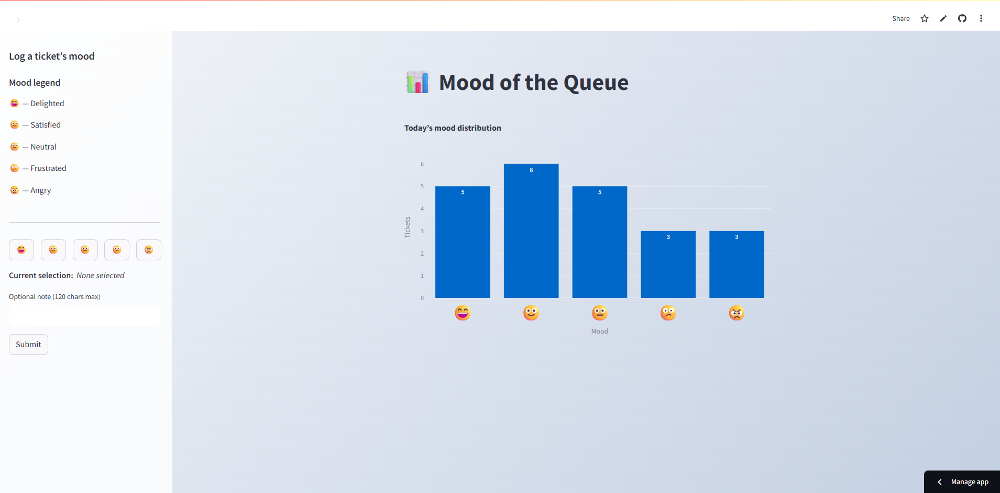

# Mochi Health - Data Scientist – Mood Tracker Take-Home-Assessment 

Hello Mochi Team,

Thank you for the opportunity to work on this take-home project!  

THis app is a lightweight, real-time (refreshes every 9s) Streamlit dashboard for logging and visualizing the mood of each support ticket. This app is designed for distributed teams—each entry is stored in a shared Google Sheet, so anyone can see the mood of the queue as it evolves throughout the day.

---

## Table of Contents

- [Features](#features)
- [Demo](#demo)
- [Getting Started](#getting-started)
  - [Local Development](#local-development)
  - [Cloud Deployment (Streamlit Cloud)](#cloud-deployment-streamlit-cloud)
- [Configuration](#configuration)
- [Usage](#usage)
- [Project Structure](#project-structure)
- [Technical Decisions & Notes](#technical-decisions--notes)

---

## Features

- 📈 **Live bar chart:** Instantly visualizes today’s mood distribution.
- 😄 **Easy logging:** Simple sidebar lets users log their mood (with emoji) and an optional note for each ticket.
- 🔄 **Real-time updates:** Dashboard auto-refreshes so every team member sees the latest data.
- ☁️ **Shared data store:** All logs are saved in a Google Sheet, making collaboration seamless.
- 🎨 **Polished UI:** Clean gradient background and big emoji bar chart labels for at-a-glance insights.
- ⚡ **No login needed:** Designed to be accessible—just run, connect, and track.

---

## Demo

<!-- Replace with a real screenshot if available -->


---

## Getting Started

### Local Development

1. **Clone the repo:**
    ```bash
    git clone https://github.com/<your-username>/mochi-mood-tracker.git
    cd mochi-mood-tracker
    ```

2. **Install dependencies:**
    ```bash
    pip install -r requirements.txt
    ```

3. **Set up your Google credentials:**
    - Create a Google Service Account and share your target Google Sheet with the service account email.
    - Download your `service_account.json` key and save it in the project root.
    - Create a `.env` file in the root:
      ```
      SHEET_KEY=your_google_sheet_id
      GOOGLE_SERVICE_ACCOUNT={"type":"service_account", ...}
      ```
      *(Or just place the JSON key file and set `SHEET_KEY`.)*

4. **Run the app:**
    ```bash
    streamlit run app.py
    ```

### Cloud Deployment (Streamlit Cloud)

1. **Push your code to GitHub.**
2. **Deploy on [Streamlit Cloud](https://share.streamlit.io/):**
    - Click "New app", select your repo and branch.
    - In **Advanced settings > Secrets**, add:
      ```
      SHEET_KEY = "your_google_sheet_id"
      GOOGLE_SERVICE_ACCOUNT = "your-service-account-json-as-a-single-line"
      ```
      (Escape all inner quotes and newlines, or use triple quotes if using `st.secrets`.)

3. **Click Deploy.**  
   Your dashboard is now live!

---

## Configuration

- **Google Sheets:**  
  - Create a Google Sheet with columns: `timestamp, mood, note`.
  - Share the sheet with your Service Account email.
  - Get the Sheet ID from the URL.

- **Secrets:**
  - Store your `SHEET_KEY` and `GOOGLE_SERVICE_ACCOUNT` as environment variables or secrets.

- **Dependencies:**  
  - Python 3.9+
  - `streamlit`
  - `gspread`
  - `google-auth`
  - `pandas`
  - `plotly`
  - `streamlit-autorefresh`
  - `python-dotenv` (for local development)

---

## Usage

- Use the sidebar to select a mood emoji for a support ticket.
- Optionally add a short note (max 120 characters).
- Click "Submit" to log.
- The bar chart updates in real time, reflecting all entries logged today.

---

## Project Structure

mochi-mood-tracker/
│
├── app.py # Main Streamlit app
├── requirements.txt # Python dependencies
├── .env # (Optional) Local secrets (never commit this)
├── service_account.json # Google Service Account key (never commit this)
├── .streamlit/
│ └── secrets.toml # (Optional) Streamlit secrets (never commit)
├── README.md # This file


---

## Technical Decisions & Notes

- **Why Google Sheets?**  
  It’s an accessible, team-friendly datastore for demo purposes, allowing simultaneous use and real-time updates.
- **Why Streamlit?**  
  It enables rapid prototyping and provides a frictionless interface for simple apps.
- **Quota Handling:**  
  Google’s Sheets API quotas are low. I use `@st.cache_data(ttl=60)` for reads and a 30s auto-refresh interval to avoid 429 errors during demo/testing.
- **UI Choices:**  
  Sidebar-driven, large emoji bar chart, and clean gradient background for a modern, readable feel.

---

**If you have any trouble running the app or want to see a quick screencast, let me know- I'm attaching my contact details below!  
Thank you for reviewing my submission and for the engaging challenge.**

---

## Created By:

    **Hrithik Sarda**
    **Phone: 9786540445**
    **Email: hrithik.sarda1@gmail.com**